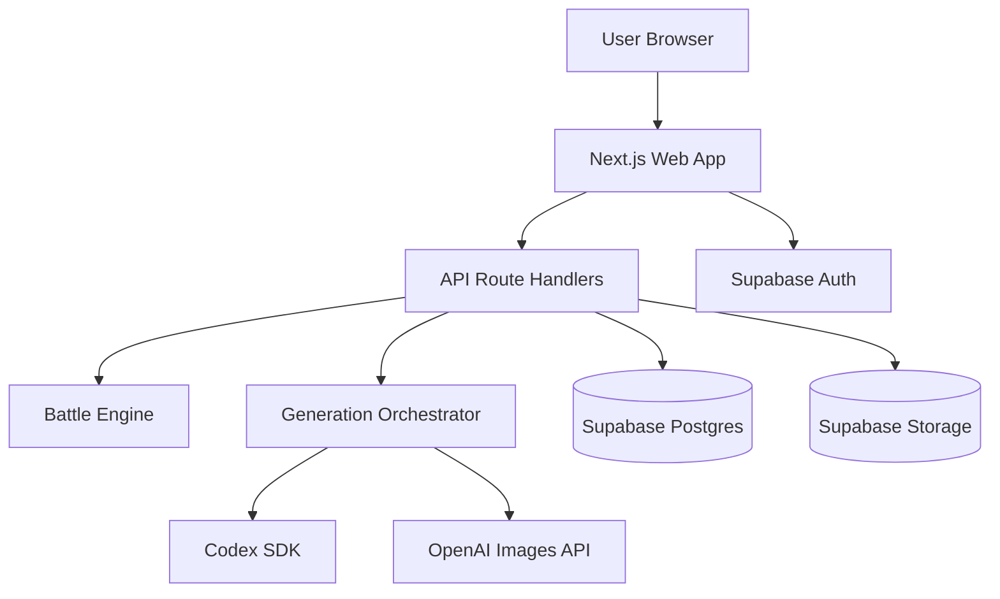

# Component Diagram

```mermaid
graph TD
  U[User Browser] --> W[Next.js Web App]
  W --> A[API Route Handlers]
  A --> B[Battle Engine]
  A --> G[Generation Orchestrator]
  G --> C[Codex SDK]
  G --> O[OpenAI Images API]
  A --> S[(Supabase Postgres)]
  A --> ST[(Supabase Storage)]
  W --> AU[Supabase Auth]
```
