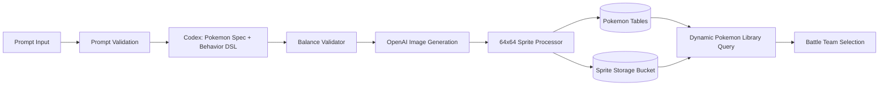

# Data Flow Diagram

```mermaid
flowchart LR
  P[Prompt Input] --> V[Prompt Validation]
  V --> CP[Codex: Pokemon Spec + Behavior DSL]
  CP --> BV[Balance Validator]
  BV --> IMG[OpenAI Image Generation]
  IMG --> PX[64x64 Sprite Processor]
  PX --> DB[(Pokemon Tables)]
  PX --> SB[(Sprite Storage Bucket)]
  DB --> LIB[Dynamic Pokemon Library Query]
  SB --> LIB
  LIB --> BAT[Battle Team Selection]
```
