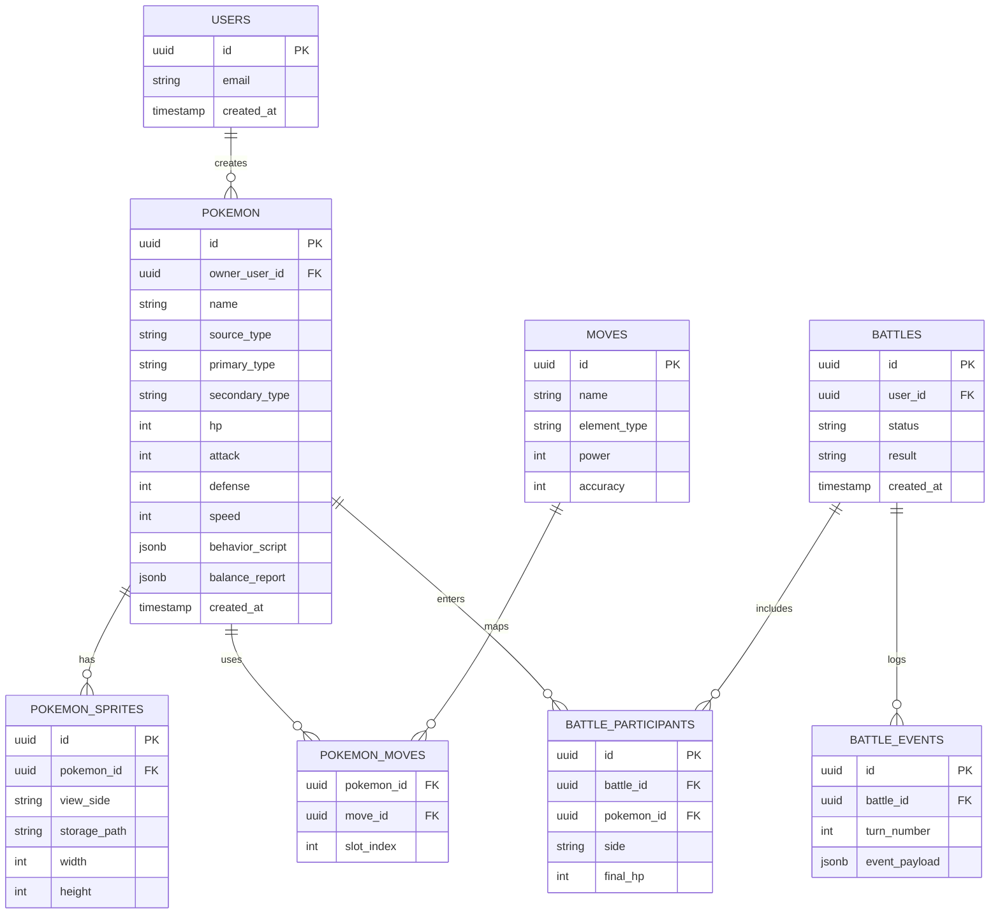

# ER Diagram

```mermaid
erDiagram
  USERS ||--o{ POKEMON : creates
  POKEMON ||--o{ POKEMON_SPRITES : has
  POKEMON ||--o{ POKEMON_MOVES : uses
  MOVES ||--o{ POKEMON_MOVES : maps
  POKEMON ||--o{ BATTLE_PARTICIPANTS : enters
  BATTLES ||--o{ BATTLE_PARTICIPANTS : includes
  BATTLES ||--o{ BATTLE_EVENTS : logs

  USERS {
    uuid id PK
    string email
    timestamp created_at
  }

  POKEMON {
    uuid id PK
    uuid owner_user_id FK
    string name
    string source_type
    string primary_type
    string secondary_type
    int hp
    int attack
    int defense
    int speed
    jsonb behavior_script
    jsonb balance_report
    timestamp created_at
  }

  POKEMON_SPRITES {
    uuid id PK
    uuid pokemon_id FK
    string view_side
    string storage_path
    int width
    int height
  }

  MOVES {
    uuid id PK
    string name
    string element_type
    int power
    int accuracy
  }

  POKEMON_MOVES {
    uuid pokemon_id FK
    uuid move_id FK
    int slot_index
  }

  BATTLES {
    uuid id PK
    uuid user_id FK
    string status
    string result
    timestamp created_at
  }

  BATTLE_PARTICIPANTS {
    uuid id PK
    uuid battle_id FK
    uuid pokemon_id FK
    string side
    int final_hp
  }

  BATTLE_EVENTS {
    uuid id PK
    uuid battle_id FK
    int turn_number
    jsonb event_payload
  }
```
