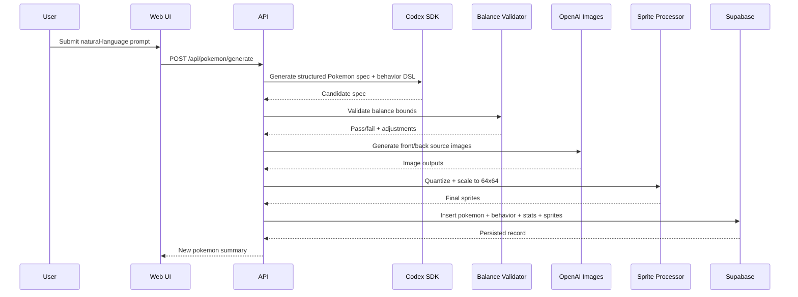

# Sequence Diagram - Pokemon Generation

```mermaid
sequenceDiagram
  participant U as User
  participant UI as Web UI
  participant API as API
  participant COD as Codex SDK
  participant VAL as Balance Validator
  participant IMG as OpenAI Images
  participant SPR as Sprite Processor
  participant DB as Supabase

  U->>UI: Submit natural-language prompt
  UI->>API: POST /api/pokemon/generate
  API->>COD: Generate structured Pokemon spec + behavior DSL
  COD-->>API: Candidate spec
  API->>VAL: Validate balance bounds
  VAL-->>API: Pass/fail + adjustments
  API->>IMG: Generate front/back source images
  IMG-->>API: Image outputs
  API->>SPR: Quantize + scale to 64x64
  SPR-->>API: Final sprites
  API->>DB: Insert pokemon + behavior + stats + sprites
  DB-->>API: Persisted record
  API-->>UI: New pokemon summary
```
